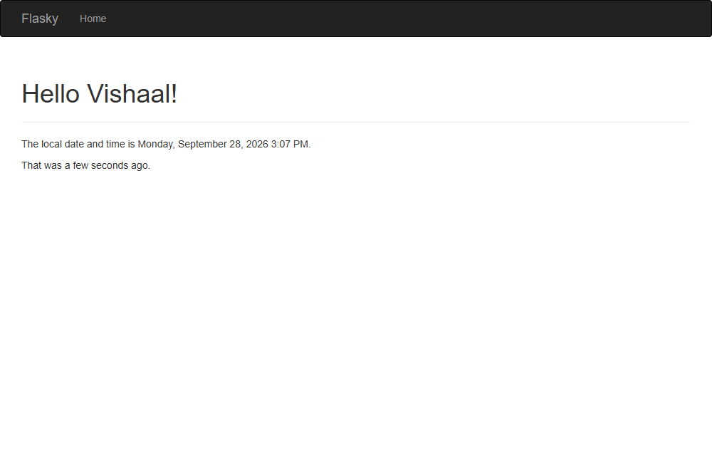
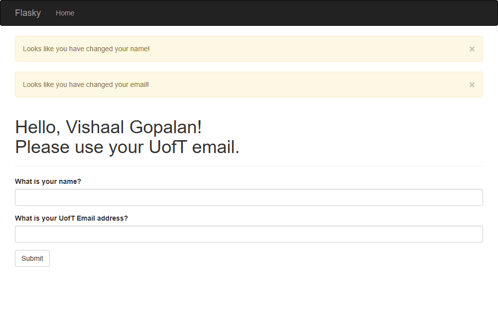

# E444-F2026-PRA3
Author: Vishaal Gopalan

This repo is a clone of https://github.com/miguelgrinberg/flasky

## Activity 1.3 - Chapter 3 (Bootstrap navbar, title, Flask-Moment timestamp)

## Activity 1.4 - Chapter 4 (UofT email field)

Name and a non-UofT email submitted:

