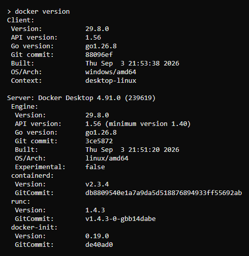
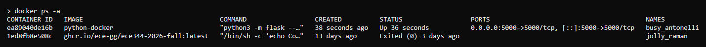
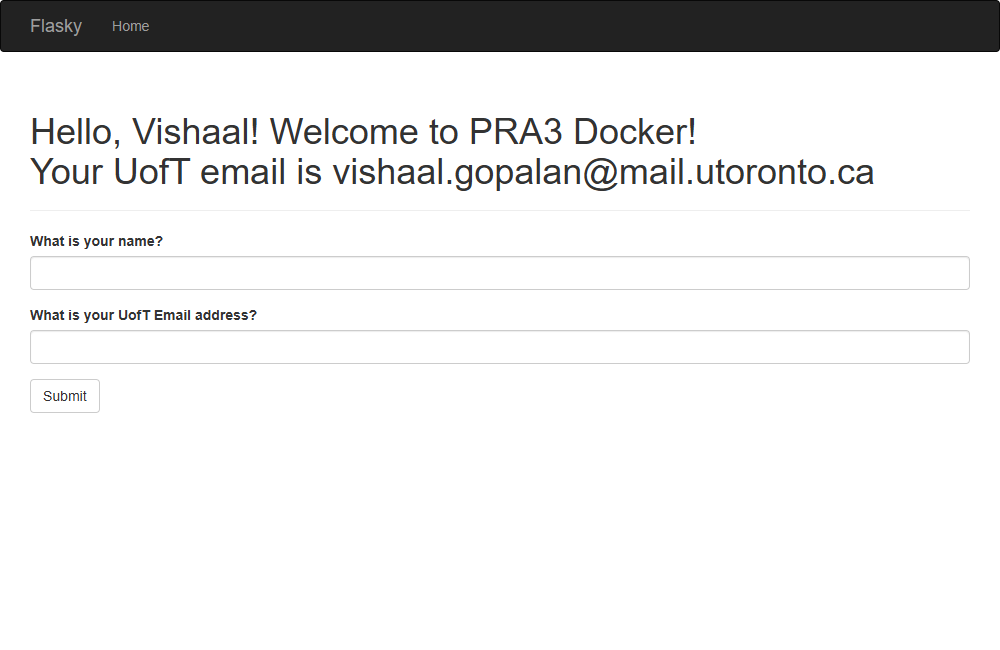
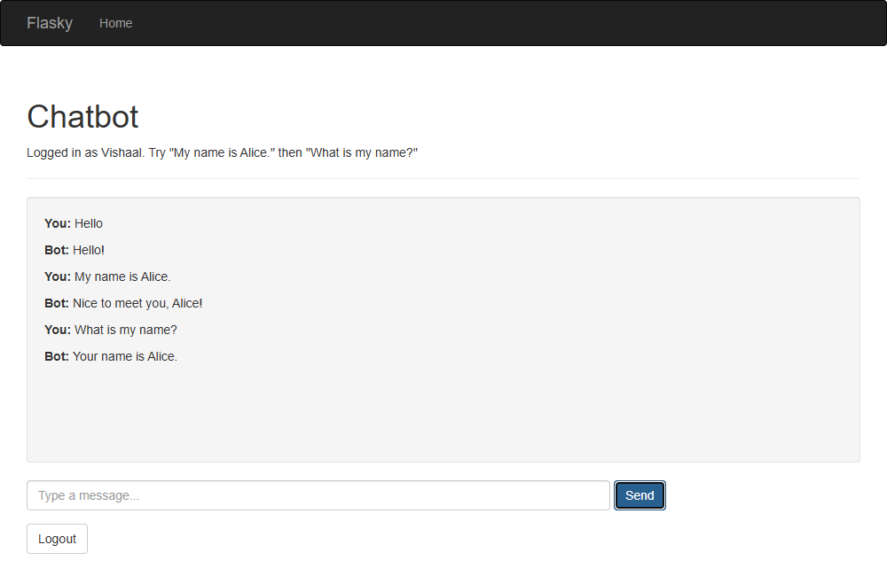
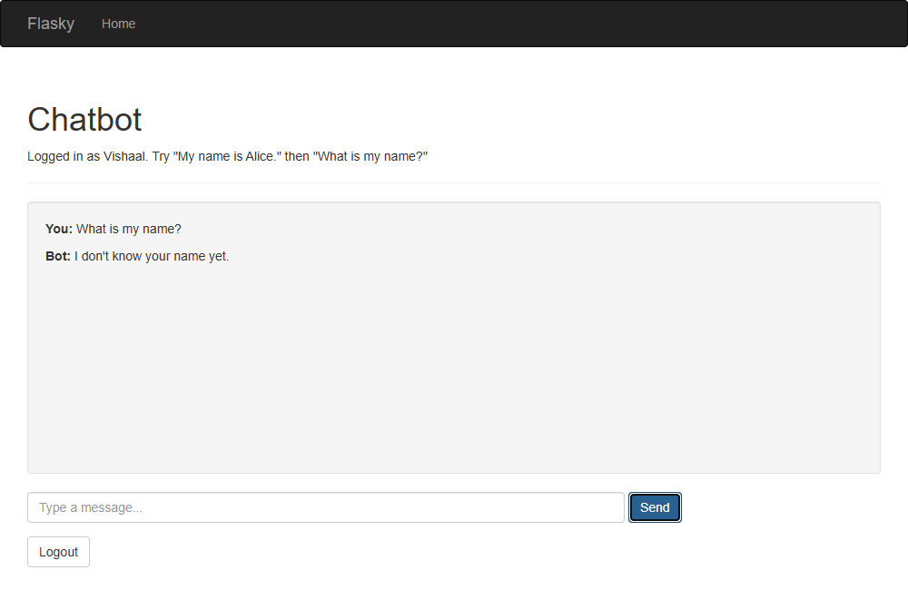

# E444-F2026-PRA3
Author: Vishaal Gopalan

This repo is a clone of https://github.com/miguelgrinberg/flasky

## Activity 1.3 - Chapter 3 (Bootstrap navbar, title, Flask-Moment timestamp)


## Activity 1.4 - Chapter 4 (UofT email field)

Name and a non-UofT email submitted:


## Activity 2.2 - Docker installed



## Activity 2.4 - Build and run the Docker image

```
docker build -t python-docker .
docker run -d -p 5000:5000 python-docker
docker ps -a
```



App served from the container at http://localhost:5000:



## Activity 2.5 - Chatbot with memory (Flask session)

The bot remembers facts across requests:



After Logout the session is cleared, and the bot no longer remembers:


